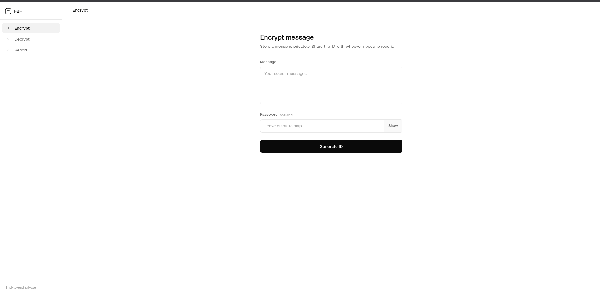

# Friend-to-Friend Messaging System

## Overview

This project is a web-based messaging prototype that allows users to securely send and retrieve messages using a unique ID system. It is designed as the first step toward building a full-scale messaging application with encryption and privacy-focused features.

---

## Features 
    1. Encrypt messages (with or without a password)
    1. Unique ID generated for every message
    1. Decrypt messages using ID + optional password
    1. Option to delete messages after reading
    1. Bug reporting system

---

## Technologies Used
    1. Frontend: HTML, CSS, JavaScript
    1. Backend: JavaScript
    1. Database: Firebase
    1. Encoding: Base64
 
---

## Inspiration

The idea behind this project was to understand how real-world messaging systems work, especially:
  
    1. Message storage and retrieval
    1. Basic encryption concepts
    1. Secure communication between users

This is a learning project aimed at building the foundation for a more advanced encrypted messaging platform in future updates.

---

## How It Works

<<<<<<< HEAD
Encryption Process :

    User inputs a message
    Message is encoded using Base64
    A unique ID is generated
    Data is stored in the database (ID + encoded message + optional password)

Decryption process :

    User enters the message ID (+ password if required)
    System validates credentials
    Message is decoded and displayed
    User can choose to delete or keep the message
    
## Incoming Updates

1. End-to-end encryption (real cryptography)
2. User accounts and authentication
3. Real-time messaging (WebSockets)
4. Improved UI/UX
5. Message expiration timers

<developed by Dreamxhava>
=======
 With this kind of database encryption method I will make a full working messaging app in the next update.

 

### I really fucked up the ui making a new one this ui was created because a new update is abt to income 
